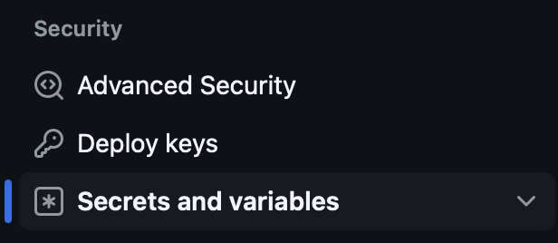

# Laboratory 11 homework

This homework extends the pipeline we developed during lab. You will enhance the `workflow.yaml`
workflow definition by adding more advanced features such as inputs, conditionals, needs, actions
and secrets.

Some of these concepts were introduced in the lab, but here we'll apply them in a complete pipeline.
Others are new:
- **conditionals** are if/else conditions, used e.g. to run a job only when a specific condition
  is met
- **needs** declare job dependencies, allowing e.g. skipping downstream jobs like model deployment,
  if their prerequisites like code checks and tests fail

### Exercise 1

1. Create **inputs** with name `steps`. There you will indicate what steps you want to run in the
   pipeline. [Documentation](https://docs.github.com/en/actions/writing-workflows/workflow-syntax-for-github-actions#onworkflow_dispatchinputs)
   will be useful. Inputs section should:
   - be named `steps`
   - have valid description
   - be required
   - have type: `choice`
   - options should be `integration` and `all`
   - have default: `all`

2. Add `if` conditional for integration and deployment jobs, using `inputs` context as configuration.
   [Documentation](https://docs.github.com/en/actions/writing-workflows/choosing-when-your-workflow-runs/using-conditions-to-control-job-execution)
   will be useful. Conditionals should:
   - run integration job only when `steps` is `all` or `integration`
   - run deployment job only when `steps` is `all`, and also note that we want to deploy only if
     everything is checked and tested correctly in the integration step

An example of using the conditional `if`:
```yaml

jobs:
  our_job:
    if:  ${{ inputs.key_name == 'desired value'  }}
```

3. Add `needs` config to declare the inter-job requirements. This configuration will create condition
   that other jobs need to successfully finish before running another job. Again, [documentation](https://docs.github.com/en/actions/writing-workflows/workflow-syntax-for-github-actions#jobsjob_idneeds)
   will be useful.
   - `deployment` job should only happen if `integration` job has finished and was successful
   - `&&` uses AND to combine multiple conditions
   - use `needs` to configure both conditions in `deployment` job configuration

An example of using `needs`:
```yaml
needs.integration.result == 'success'
```

### Exercise 2

In this exercise, you will need AWS account and private ECR repository there.

1. Log in to your AWS account (regular or Educate), go to ECR, create repository.
2. Copy your keys (those are secrets, **never** commit them!):
   - `AWS_ACCESS_KEY_ID`
   - `AWS_SECRET_ACCESS_KEY`
   - `AWS_SESSION_TOKEN`
3. Navigate to GitHub -> repository -> settings -> `security` section -> `secrets and variables`
   -> `actions`.
   
4. Add new repository secrets for your keys. Name them exactly the same for the readability.
5. Add a new step in `deployment` job called `Set up AWS credentials`:
```yaml
- name: Set up AWS credentials
  uses: aws-actions/configure-aws-credentials@v1
  with:
    aws-access-key-id: ${{ # secrets.YOUR_SECRET }}
    aws-secret-access-key: ${{ # use secrets context }}
    aws-session-token: ${{ # use secrets context }}
    aws-region: # use your region
 ```
6. Add a new step in `deployment` job called `Login to ECR`:
```yaml
- name: Login to ECR
  id: login-ecr
  uses: aws-actions/amazon-ecr-login@v2
  with:
     mask-password: 'true' 
```
7. Add a new step in `deployment` job called `Push Docker image`:
   - It should contain environment variables:
     * **REGISTRY**: `${{ steps.login-ecr.outputs.registry }}`
     * **REPOSITORY**: `# our ecr repository name`
     * **IMAGE_TAG**: `${{ github.sha }}`
   - It should be tagged before push: `$REGISTRY/$REPOSITORY:$IMAGE_TAG`.
   - Use `docker tag <previous image name:with_tag> <above required tag>`

Execute full workflow, document successful jobs, show pushed image with valid tag.
Compare `image_tag` with actual `github.sha`.

## Grading

For grading, document your work with screenshorts after each exercise or step.
In each iteration run your workflow changing inputs options.

1. Exercise 1 (4 points):
   - inputs: 2 points
   - conditional: 1 point
   - needs: 1 point
2. Exercise 2 (6 points):
   - ECR repository creation: 1 point
   - secrets export: 1 point (**do not** show values, just their existence!)
   - AWS credentials setup: 1 point
   - login to ECR: 1.5 points
   - pushing Docker image to ECR: 1.5 points
