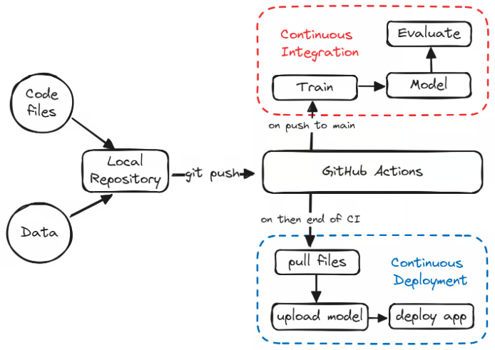
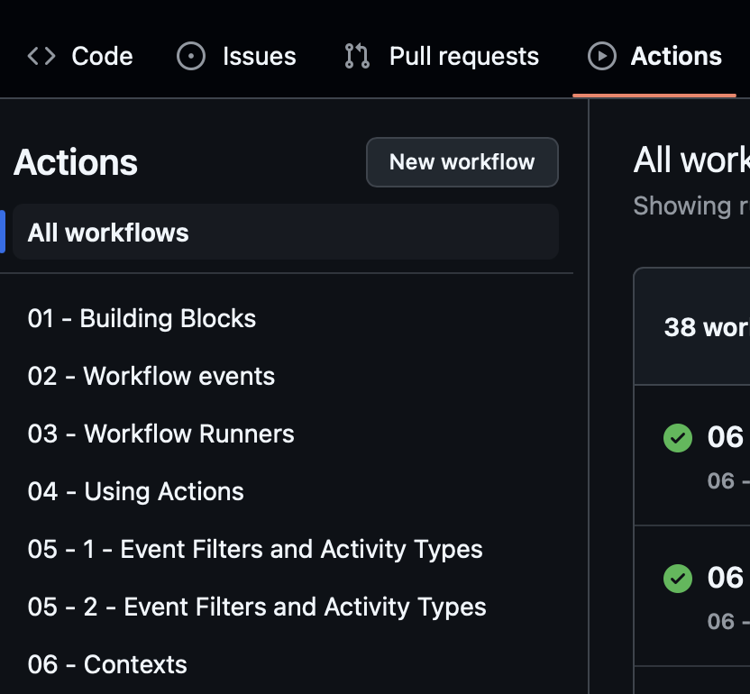

# Lab 11 - Deployment & CI/CD

## Introduction

This lab will cover deployment of ML models for inference. Models are optimized
for inference with tools like ONNX, and deployment processes are automated with
CI/CD pipelines. This results in efficient and seamless model updates.

We recommend using own local environment. However, if you have problems or would
like to try something new, GitHub Codespaces can also be used.

---

### Why do we need CI/CD in ML?

> Continuous Delivery is the ability to get changes of all types — 
including new features, configuration changes, bug fixes, and experiments — 
into production, or into the hands of users, safely and quickly in a sustainable way.
> 
> Jez Humble and Dave Farley, https://continuousdelivery.com/

> Continuous Delivery for Machine Learning (CD4ML) 
is a software engineering approach in which a cross-functional team 
produces machine learning applications based on code, data, and models 
in small and safe increments that can be reproduced and reliably released at any time, 
in short adaptation cycles.
>
> -- <cite>Martin Fowler, https://martinfowler.com/articles/cd4ml.html</cite>

In short, CI/CD approach in MLOps helps us develop, manage, and deliver machine learning
software in an automated way. Different teams, responsible e.g. for data, modeling and
infrastructure management, can develop their parts independently, relying on automated
processes for repeatable tasks. CI/CD ensures reproducibility throughout the entire cycle
and enables us to continuously ship new versions of the software into production.



Source - [DataCamp](https://www.datacamp.com/tutorial/ci-cd-for-machine-learning?dc_referrer=https%3A%2F%2Fwww.perplexity.ai%2F)

### GitHub Actions

It's a tool that allows us to build and run automated pipelines (workflows) using YAML definitions.
Public repositories get unlimited hours and quite powerful machines, enough for almost all
open source projects.

[Features](https://github.com/features/actions) include:
1. **Hosted runners**, e.g. Linux, macOS, Windows, run directly on VM or inside a container.
2. **Many languages**, e.g. Python, Java, Node.js.
3. **Logs** allowing monitoring in real-time and debugging failures.
4. **Environments variables & secrets store** built in and easy to use.

### Setting up a GitHub repository

Simply create new public repository on GitHub and setup connection to the repo locally.
Public repositories get unlimited hours for GitHub Actions workflows.
See [documentation](https://docs.github.com/en/actions/using-github-hosted-runners/using-github-hosted-runners/about-github-hosted-runners#standard-github-hosted-runners-for-public-repositories) for details.

### Using GitHub Codespaces (optional)

[GitHub Codespaces](https://github.com/features/codespaces) is basically a virtual session in the browser
with VS Code ready to use. It contains preinstalled software like popular programming languages, Docker,
curl, and more. It is great as a learning platform and for quickly trying out things.

It is free for individual use up to 60 hours per month, with machines having 2 cores, 4 GB of RAM and
15 GB of storage. After that, it uses pay-as-you-go pricing, so don't exceed the time limit. For the
purpose of this lab, this will very easily suffice.

### Preparing our first GitHub Actions workflow

1. Create `.github/workflows` directory. All workflows are defined there.
2. Create file `hello_world.yaml` there.
3. Write workflow that:
   - runs on `ubuntu-latest` image
   - prints `Hello world!` using `echo` command

```yaml
name: Hello World workflow
on:
  # workflow_dispatch option enables manual trigger button
  workflow_dispatch:

# under job key we define the names and jobs definitions, typically as multiple steps
# e.g. what commands to run, what environment to set
jobs:
  # our job name: `hello-world-job`
  hello-world-job:
    # our job definition
    runs-on: ... # here, define image on which we will run our job
    
    # definitions of all job steps
    steps:
      name: Print Hello World # step name, displayed on UI
      run: ... # print "Hello world!" here
```

4. Commit changes
5. Navigate to GitHub -> your repository -> Actions -> All workflows -> Hello World workflow

6. Click on `Run workflow` button and trigger job.

7. Refresh the page and navigate to executed job. When you click on rectangle with step name,
   you will see list of steps and their statuses. You can also inspect logs printed by each step.
8. Document your result, e.g. by screenshot with `Hello World` printed.

---

### Exploring GitHub Actions features

**Workflows vs Jobs vs Steps**

**Workflows** are the highest-level configuration in GitHub Actions. They are 
triggered by events like:
- commiting pushes to branches
- pull requests, e.g. on opening or closing
- on schedule, e.g. using cron scheduling

They contain one or more jobs, each performing different tasks, e.g. builds with
different OS configurations. In MLOps, we can define separate workflows for individual
tasks, like code testing or model deployment.

**Jobs** are groups of steps, each running on a given virtual machine. Jobs are isolated,
i.e. each one gets a fresh environment and can run independently of other jobs. By default,
jobs run in parallel for efficiency, but you can also set inter-job dependencies. This is
useful in MLOps when you first verify code in a lightweight VM, and then, if everything goes
well, larger VM is used for model compilation and deployment.

**Steps** are individual tasks within a job, e.g. commands or actions. They run sequentially,
in order, inside the same job environment. They can modify it, sharing files and environment
variables. In MLOps, those can include running code checkers, linters, or tests.

Summarizing:
- workflow contains jobs, job consists of steps
- workflows are triggered by events
- jobs run inside the workflow, independently (in parallel) or with defined dependencies
- steps are specific commands, executed sequentially, that do the actual work in jobs

### Workflow events

**Workflow events** in GitHub Actions are specific activities in your repository that can
automatically start (trigger) your workflows. Those are e.g. pushing commits, opening a PR,
or adding a Git tag. You define which events trigger a workflow, using the `on` key in
workflow definition. Some are more configurable, e.g. run only on comment creation in a PR,
not edit or delection.

Workflow events can be used in MLOps e.g. to run tests on each commit, or to deploy a new
model version upon tagging a Git commit.

```yaml
# on: Git commit push
name: My Workflow on push

on: push

jobs:
  ...
```

```yaml
# on: pull_request - with filtering by event_types / branches
name: My Workflow on pull_request with filtering

on:
   pull_request:
      types:
         - opened
         - synchronized
      branches:
         - master
         - develop

jobs:
  ...
```

### Contexts

**Contexts** are used to access dynamic or configured values in workflows.
Those can be e.g. repository or event information (`github`), environment
variables (`env`), user-provided inputs (`inputs`), or centrally managed
configuration (`vars`). Those are very indispensable for building configurable
workflows in MLOps, e.g. to select model version, access environment configuration,
or safely use secrets.

Let's take a look at a few contexts.

`github` [context](https://docs.github.com/en/actions/writing-workflows/choosing-what-your-workflow-does/accessing-contextual-information-about-workflow-runs#github-context)
is used to get information about repository, event, or workflow run itself.
```yaml
# github context
name: Github context example
on: workflow_dispatch
jobs:
  show-github-context:
    runs-on: ubuntu-latest
    steps:
       - name: Github Context
         run: | # "|" is a new line in YAML, useful for readable multiline commands
          echo "Event Name: ${{ github.event_name }}"
          echo "Ref: ${{ github.ref }}"
          echo "SHA: ${{ github.sha }}"
          echo "Actor: ${{ github.actor }}"
          echo "Workflow: ${{ github.workflow }}"
          echo "Run ID: ${{ github.run_id }}"
          echo "Run number: ${{ github.run_number }}"
```

`inputs` [context](https://docs.github.com/en/actions/writing-workflows/choosing-what-your-workflow-does/accessing-contextual-information-about-workflow-runs#inputs-context)
gets values provided by the user or another workflow as input configuration.
```yaml
# inputs context
name: Inputs context example
on:
  workflow_dispatch:
    inputs:
      to_deploy:
        type: boolean
        default: false
        description: 'Deploy app to production after integration and build step?'

jobs:
  show-input:
    runs-on: ubuntu-latest
    steps:
       - name: Inputs contexts
         run: |
          echo "Deploy?: ${{ inputs.to_deploy }}"
```

`env` [context](https://docs.github.com/en/actions/writing-workflows/choosing-what-your-workflow-does/accessing-contextual-information-about-workflow-runs#env-context)
is used to store and reuse configuration values across steps, jobs, or entire workflows. Note that
step-level environment overrides job- and workflow-level ones if necessary.
```yaml
# env context
name: Env context example
on: push

# workflow env (global for all jobs)
env:
   GREETING: Hello

jobs:
   show-env:
      runs-on: ubuntu-latest
      # job env (global for all steps within job)
      env:
         TARGET: World
      steps:
         - name: Env context
           run: |
            echo "${{ env.GREETING }} ${{ env.TARGET }}"
         - name: Overwritten env context
           env: # step env (local env for specific step)
              GREETING: HELLO!
           run: |
            echo "${{ env.GREETING }} ${{ env.TARGET }}"
```

`vars` [context](https://docs.github.com/en/actions/writing-workflows/choosing-what-your-workflow-does/accessing-contextual-information-about-workflow-runs#vars-context)
are used for non-sensitive environment variables configuration values
that you want to reuse, e.g. base URLs for services.
```yaml
# vars context
# variables are repository-level variables that can be reused in many individual workflows
name: Vars Context Example

on: workflow_dispatch

jobs:
   show-vars:
      runs-on: ubuntu-latest
      steps:
         - name: Show a configuration variable
           run: |
            echo "Config variable: ${{ vars.MY_CONFIG }}"
```

`secrets` [context](https://docs.github.com/en/actions/writing-workflows/choosing-what-your-workflow-does/accessing-contextual-information-about-workflow-runs#secrets-context)
is used for sensitive data that must be kept secure and not shown in logs, e.g.
API keys or access codes.
```yaml
# secrets context
# secrets are repository-level variables that should be encrypted
# and can be reused in many individual workflows

name: Secrets Context Example

on: workflow_dispatch

jobs:
   show-secrets:
      runs-on: ubuntu-latest
      steps:
         - name: Use a secret (masked in logs)
           run: |
            echo "API Key: ${{ secrets.API_KEY }}"
```

---

### Building a CI pipeline - running checks and tests

In this exercise, we will enhance [this](https://drive.google.com/file/d/1KTDi11sKYW0dRjqdUlAee1vsRHLGfEO6/view?usp=drive_link) project,
which hosts an application for performing sentiment analysis using 
the `bardsai/twitter-sentiment-pl-base` [model](https://huggingface.co/bardsai/twitter-sentiment-pl-base).
Our focus will be on two key configuration files:
- pyproject.toml
- Makefile

In `pyproject.toml`, there is a `[dependency-groups]` section that organizes dependencies
into three distinct groups:
- integration
- deployment
- inference

Separating dependencies in groups is crucial in MLOps, which typically uses huge sets of
dependencies, with various stages (e.g. training, inference) having very distinct requirements.
Having different dependency groups for each model lifecycle stage keeps the project tidy,
increases efficiency, lowers Docker image sizes, and more.

Here, we will concentrate on the `integration` group. Review the packages listed under
this group in `pyproject.toml`. If you don't recognize them, read a bit about them and
what they do.

We will now take a look at `Makefile`. It defines `make` instructions, which execute terminal
commands one after another. It has been designed to assist with complex compilation workflows
in C and C++, but is also frequently used for all kinds of automations, e.g. to run a sequence
of Python scripts. See [this tutorial](https://makefiletutorial.com/) for an in-depth introduction.
`make` is very useful in MLOps to standardize running many programs, e.g. downloading data from
many sources, or configuring environment prior to model training.

Open `Makefile` and locate the following targets:
- run_ruff
- run_pip_audit
- run_tests

These targets automate our integration checks, ensuring code quality, security compliance,
and correctness. When we talk about integration in a CI context, we mean validating our application
against best practices and known security vulnerabilities. 

The `integration` dependency group includes only the tools necessary to run tools used in
those `make` targets:
- `ruff`, for linting and formatting
- `pip audit`, for scanning dependencies for vulnerabilities
- `pytest`, for executing our test suite

Keeping these dependencies minimal prevents unnecessary clutter and speeds up our CI runs.

--- 

We will now create a GitHub Actions workflow file `.github/workflows/ci_cd_workflow.yaml`
to automate our integration checks. We could use `make`, but instead, we will invoke each
tool directly via `uv` to be explicit.

Below is the complete workflow definition — read through it carefully and make sure you
understand each step. Note that we are using a pre-built `action` here, which are reusable
steps published in many GitHub repositories.

```yaml
# our CI/CD workflow .yaml file

name: CI/CD workflow

on: workflow_dispatch

jobs:
   integration:
      name: checks_and_tests
      runs-on: ubuntu-latest
      steps:
         - name: Checkout code repo
           # this action clones current repository to the VM where our job is running
           # https://github.com/actions/checkout
           uses: actions/checkout@v4
           
         - name: Setup uv
           run: curl -LsSf https://astral.sh/uv/install.sh | sh
           
         - name: Install dependencies
           run: uv sync --group integration
           
         - name: Run ruff check
           run: uv run ruff check
           
         - name: Run pip-audit
           run: uv run pip-audit --vulnerability-service pypi

         - name: Run PyTest
           run: uv run pytest tests
```

After this workflow, the code will be linted, formatted, audited for security issues, and
tested. This sequence runs on every manual run, but we could also configure this to run
for every commit in an opened PR, for example. This ensures a consistent, high-quality codebase
and catches problems early in the development cycle.

---

## Model optimization with ONNX

The Open Neural Network Exchange (ONNX) is an [open, standardized format](https://onnx.ai/) 
ML models, designed to enable seamless interoperability between different frameworks and runtimes.
Instead of relying on heavy libraries like Transformers or PyTorch during inference deployment,
ONNX exports your trained model to an intermediate format. This also allows optimization for the
target platform (e.g. CPU inference), removing parts used only in training (e.g. freezing BatchNorm),
or merging operators for more efficient inference. Resulting models can be run by lightweight and
efficient runtimes interoperable with ONNX format, e.g. [ONNX Runtime](https://onnxruntime.ai/).

ONNX has two major advantages:
1. **Interoperability** - you train your models in any framework that you want, e.g. PyTorch or
   HuggingFace Transformers, and then export it to a standardized ONNX format. You can then run
   them in the same runtime in production, e.g. ONNX Runtime, which standardizes operational
   processes. This even allows you to run inference in other programming languages and platforms,
   e.g. Go, Rust, or on mobile and IoT devices.
2. **Efficient inference** - ML runtimes are smaller dependencies than e.g. whole PyTorch, reducing
   container size and startup time. Models can also be "frozen" and optimized for inference, which
   makes them faster and reduces memory footprint.

### Adding ONNX to CI/CD pipeline

Building upon our existing CI/CD workflow, let's implement a deployment job that handles downloading,
optimizing, and exporting the ML model. This job will run the provided Python scripts sequentially to
prepare your model for deployment.

The deployment process involves two main steps located in the `src/scripts/` directory:
1. Downloading the model artifacts using `download_artifacts.py`
2. Exporting the model to `ONNX` format using `export_model_to_onnx.py`

Both of them should be executed sequentially by running `main.py` with additional parameter `--script`
with value in `[download, export]`.

As an exercise, modify the previous YAML workflow, implementing a second job that contains steps:
1. Checkout repo with `actions/checkout@v4`.
2. Setup `uv`.
3. Using `uv` install `deployment` dependencies only.
4. Download model using prepared script.
5. Export model using prepared script.

```yaml
# our CI&CD workflow .yaml file

name: CI/CD workflow

on: workflow_dispatch

jobs:
   integration:
      name: continuous-integration
      runs-on: ubuntu-latest
      steps:
        ...
   deployment:
      name: # meaningful name
      runs-on: # appropriate image
      steps: # define steps
```

---

### Lightweight Docker image for ML inference

GitHub Actions allows us to build Docker image of our application. But to be 100% sure of software that is 
available for our use we can examine runner docs provided for all major options:
- [Ubuntu](https://github.com/actions/runner-images/blob/ubuntu24/20250420.1/images/ubuntu/Ubuntu2404-Readme.md)
- [Windows](https://github.com/actions/runner-images/blob/ubuntu24/20250420.1/images/windows/Windows2025-Readme.md)
- [macOS](https://github.com/actions/runner-images/blob/ubuntu24/20250420.1/images/macos/macos-15-Readme.md)

Let's focus on `Dockerfile` definition now. We want to build a lightweight image, containing only the
strictly necessary files and software required to run model inference. The definition below fulfills
this requirement, using a [multi-stage build](https://docs.docker.com/build/building/multi-stage/). This
mechanism allows you to separate dependencies required only for Docker setup, e.g. include C and C++
compilers only to install libraries and compile whatever is necessary, and copy the resulting artifacts
to the final stage for inference. This way, by copying just the selected files from previous build
stage, the final image size is minimized, which start up containers much faster.

```Dockerfile
# create the initial "builder" layer
FROM python:3.13-slim-bookworm AS builder

WORKDIR /app

# update system, then remove unnecessary libraries
RUN apt-get update && apt-get install -y make && rm -rf /var/lib/apt/lists/* 

# install uv, get dependencies, and install only inference group
RUN pip install uv
COPY pyproject.toml uv.lock ./
RUN uv sync --group inference 

# prepare new environment without unnecessary software, e.g. make, uv
# this is another stage, starting from fresh Docker base image
FROM python:3.13-slim-bookworm AS runtime

WORKDIR /app
ENV PATH="/app/.venv/bin:$PATH"

# copying necessary dependencies from previous builder layer
COPY --from=builder /app/.venv /app/.venv

# copying files needed to run inference
COPY settings.py settings.py
COPY app.py app.py
COPY src/inference/ ./src/inference
COPY artifacts/onnx/twitter-sentiment-pl-base.onnx ./artifacts/onnx/twitter-sentiment-pl-base.onnx
COPY artifacts/tokenizer/tokenizer.json ./artifacts/tokenizer/tokenizer.json

# run webserver
EXPOSE 8000
CMD ["uvicorn", "app:app", "--host", "0.0.0.0", "--port", "8000"]
```

Add a new step in the workflow YAML file under `deployment` job and name it appropriately.
Build the Docker under the `run` key:

```bash
docker build -t polish-sentiment-app-onnx:latest .
```

Run your workflow and make sure that everything works fine.

---

## Summary

In this lab, we created a CI/CD pipeline for checking and testing code, model
optimization, and building Docker for optimization. We used GitHub Actions for
orchestrating steps and organizing the process, and ONNX as intermediate format
for model representation. In the homework, we will further expand this pipeline.
